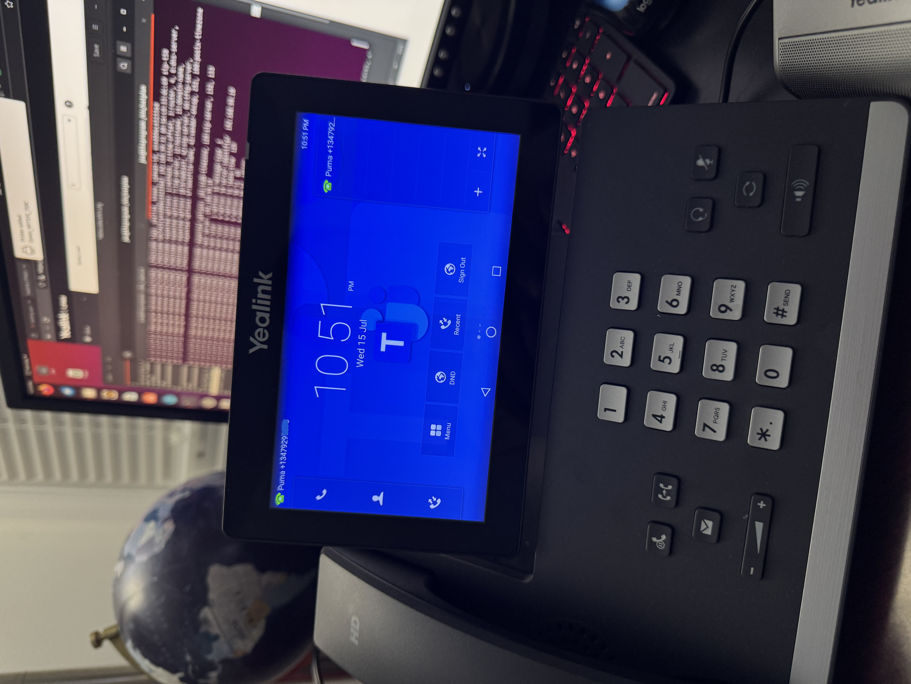
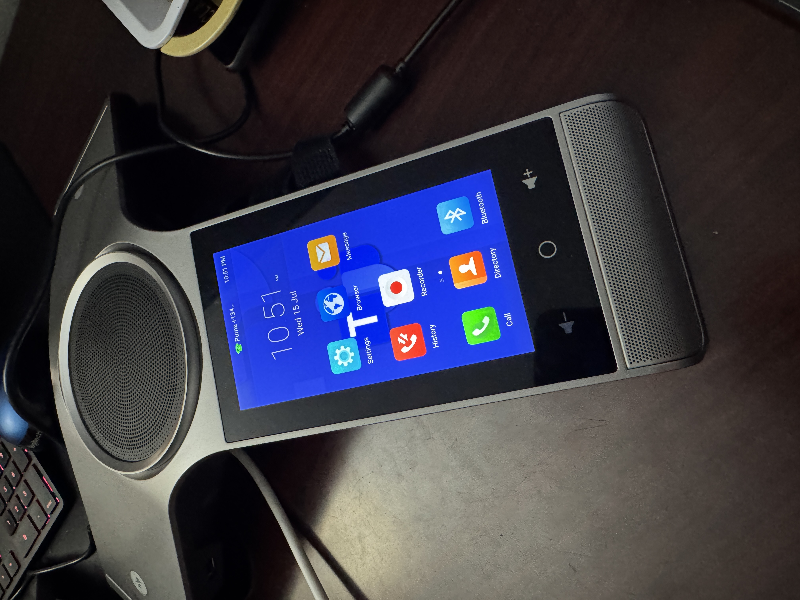

<p align="center">
  
  &nbsp;&nbsp;&nbsp;&nbsp;
  
</p>

<h1 align="center">Manual Microsoft Teams SIP Gateway Onboarding for Yealink Devices</h1>

This repository documents and automates a tested manual onboarding workflow for certain **Yealink SIP phones** that cannot complete Microsoft Teams SIP Gateway onboarding with their native provisioning or SIP identity.

> **Tested scope:** Yealink devices only. This is not a universal SIP-device onboarding method. Check Microsoft's current [SIP Gateway compatible-device and firmware list](https://learn.microsoft.com/en-us/microsoftteams/devices/sip-gateway-plan) before deployment.

## Why this workflow is needed

Two identities matter:

1. The HTTP provisioning requests must use a supported Yealink-style User-Agent so Microsoft returns the staged MAC configuration files.
2. The phone must be primed before Account 1 is created with `account.1.custom_ua` so its SIP REGISTER and related SIP traffic also use the accepted identity.

Example priming setting in the TFT/TFTP-served `-all.cfg`:

```cfg
account.1.custom_ua = Yealink SIP-<MODEL> <FIRMWARE> <MAC12>
```

Example with masked values:

```cfg
account.1.custom_ua = Yealink SIP-T57W 96.86.5.1 805eXXXXdc69
```

This setting is crucial. A successful `curl` download does not prove that the phone's SIP traffic will register or appear online. The custom SIP UA should already exist when Microsoft Stage 2 creates Account 1.

## MAC formats

Use the 12-character MAC in filenames:

```text
805eXXXXdc69.cfg
```

Use the colon-formatted MAC in the HTTP User-Agent:

```text
80:5e:XX:XX:dc:69
```

Example:

```text
Yealink SIP-T57W 96.86.5.1 80:5e:XX:XX:dc:69
```

## How the onboarding stages work

### Stage 1

Stage 1 uses the fixed Microsoft entry server:

```text
http://noam.ipp.sdg.teams.microsoft.com/<MAC12>.cfg
```

It returns the Stage 2 URL in:

```cfg
static.auto_provision.server.url = https://usea.dm.sdg.teams.microsoft.com/device/ob/<OB-HASH>/lang_en/
```

### Stage 2

The script immediately downloads Stage 2 before asking you to import anything:

```text
https://usea.dm.sdg.teams.microsoft.com/device/ob/<OB-HASH>/lang_en/<MAC12>.cfg
```

Stage 2 creates the temporary onboarding account and returns the unique Stage 3 state URL:

```cfg
account.1.user_name = <MAC12><TEMP-SUFFIX>@onboarding.org
account.1.auth_name = <MAC12><TEMP-SUFFIX>
account.1.password = <TEMP-PASSWORD>
account.1.sip_server.1.address = obsbc-<REGION>.sdg.teams.microsoft.com

auto_provision.server.url =
https://usea.dm.sdg.teams.microsoft.com/device/state/OnBoarding/mmiiaacc/<STATE-TOKEN>/lang_en/
```

Every new Stage 2 request can mint new temporary credentials and a new `<STATE-TOKEN>`. The exact Stage 3 URL from the original Stage 2 file must be preserved.

### Stage 3

After the device is verified and the Teams phone user signs in, the same preserved Stage 3 URL eventually returns a changed configuration:

```text
https://usea.dm.sdg.teams.microsoft.com/device/state/OnBoarding/mmiiaacc/<STATE-TOKEN>/lang_en/<MAC12>.cfg
```

The final configuration changes from the temporary onboarding account to the assigned user and production SBC:

```cfg
account.1.display_name = <DISPLAY-NAME>
account.1.label = <DISPLAY-NAME> <E164-NUMBER>
account.1.user_name = <E164-NUMBER>@<TENANT-DOMAIN>
account.1.auth_name = <GENERATED-AUTH-NAME>
account.1.password = <GENERATED-PASSWORD>
account.1.sip_server.1.address = mainsbc-<REGION>.sdg.teams.microsoft.com
```

It also normally changes the provisioning path to:

```text
https://usea.dm.sdg.teams.microsoft.com/device/mmiiaacc/<STATE-TOKEN>/lang_en/
```

## Interactive onboarding workflow

The script performs the steps in this order:

1. Downloads Stage 1 once.
2. Parses Stage 1 and downloads Stage 2 once.
3. Preserves the exact Stage 3 URL generated by Stage 2.
4. Pauses so Stage 1 can be uploaded/imported.
5. After Stage 1 finishes importing, pauses so Stage 2 can be uploaded/imported.
6. The phone reboots after Stage 2 is applied.
7. When the phone returns, it should show connected and ready for onboarding.
8. The script prompts for the TAC verification code.
9. The script displays `*55*<verification-code>`.
10. Dial the code from the phone.
11. After the call completes, the device enters sign-in mode.
12. Complete Teams sign-in in a **computer web browser**.
13. The script polls the same preserved Stage 3 URL.
14. When Stage 3 differs from Stage 2, the script saves the final configuration.
15. Upload/import the final Stage 3 configuration into the phone.

Do not restart Stage 1 or Stage 2 after verification begins.

## Curl commands used

Set the masked example values:

```bash
MAC="805eXXXXdc69"
UA="Yealink SIP-T57W 96.86.5.1 80:5e:XX:XX:dc:69"
```

Stage 1:

```bash
curl -v -L \
  -A "$UA" \
  "http://noam.ipp.sdg.teams.microsoft.com/${MAC}.cfg" \
  -o "${MAC}-stage1.cfg"
```

Stage 2, using the exact URL found in Stage 1:

```bash
STAGE2_BASE="https://usea.dm.sdg.teams.microsoft.com/device/ob/<OB-HASH>/lang_en"

curl -v -L \
  -A "$UA" \
  "${STAGE2_BASE}/${MAC}.cfg" \
  -o "${MAC}-stage2.cfg"
```

Stage 3, using the exact URL found in Stage 2:

```bash
STAGE3_BASE="https://usea.dm.sdg.teams.microsoft.com/device/state/OnBoarding/mmiiaacc/<STATE-TOKEN>/lang_en"

curl -v -L \
  -A "$UA" \
  "${STAGE3_BASE}/${MAC}.cfg" \
  -o "${MAC}-stage3-final.cfg"
```

## Running the script

```bash
chmod +x teams_onboarding_flow.sh
./teams_onboarding_flow.sh <MAC12> <MODEL> <FIRMWARE>
```

Example:

```bash
./teams_onboarding_flow.sh 805eXXXXdc69 T57W 96.86.5.1
```

Each run creates a timestamped directory:

```text
<MAC12>-onboarding-YYYYMMDD-HHMMSS/
```

It contains the stage files, `session.env`, and `workflow.log`.

## Security

The generated files may contain live SIP credentials, user names, phone numbers, tenant domains, and onboarding tokens. Do not commit generated `.cfg` files, session files, logs, packet captures, or real device identifiers.

## Tested lab hardware

The following photos show Yealink devices connected to Microsoft Teams SIP Gateway in the lab.

### Yealink T58A connected to Teams SIP Gateway

<p align="center">
  
</p>

### Yealink CP960 connected to Teams SIP Gateway

<p align="center">
  
</p>

These photos document the lab setup. Compatibility and support status can change, so verify the model and firmware against Microsoft's current published list.
